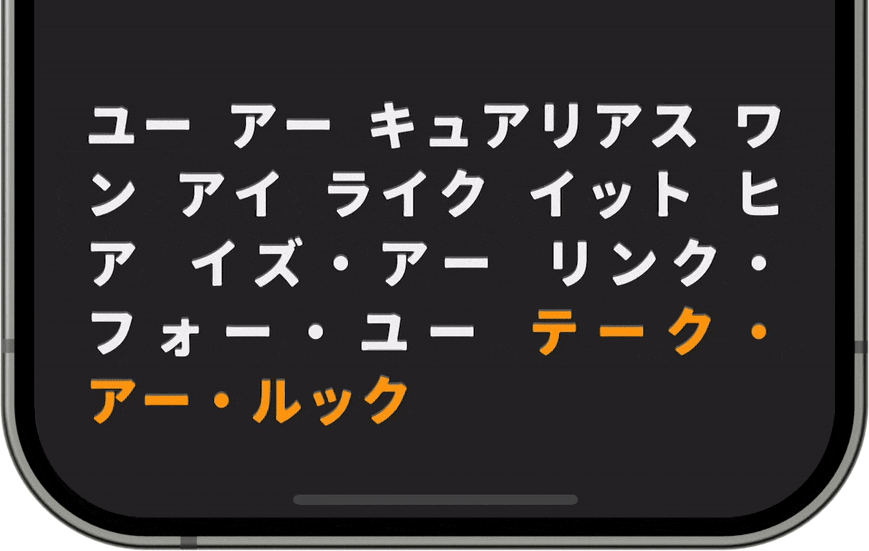

# RichTextLabel 
<!-- MOBO font is used in the header animation, link: https://flopdesign.booth.pm/items/4647262  -->

Subclass of UILabel that simplifies work with rich text, providing Markup processing, custom links styling and interaction handling (both tap and long-press gestures), and more
<br>
<br>

## Requirements
`‎ UIKit: iOS 12+ ‎` `‎ SwiftUI: iOS 14+ ‎` `‎ XCode 14+ ‎`

## Installation

#### CocoaPods
Add to a target's pods in your `Podfile`:
```ruby
pod 'RichTextLabel', :git => 'https://github.com/fffonoff/RichTextLabel.git', :tag => '0.1.0'
```

In case if [DTTextWithHtmlProcessor](#dttextwithhtmlprocessor) with its [DTCoreText](https://github.com/Cocoanetics/DTCoreText) dependency, is not required, use Core subspec:
```ruby
pod 'RichTextLabel/Core', :git => 'https://github.com/fffonoff/RichTextLabel.git', :tag => '0.1.0'
```

#### Swift Package Manager
Go to **File → Add Package Dependencies…** and search for [Repository URL](https://github.com/fffonoff/RichTextLabel). RichTextLabel package comes with two targets, choose either of those (<ins>but not both</ins>):
- **RichTextLabel**: the core module, use it in case if [DTTextWithHtmlProcessor](#dttextwithhtmlprocessor) is not required
- **RichTextLabelDT**: includes [DTTextWithHtmlProcessor](#dttextwithhtmlprocessor) in addition to the core module

How to add RichTextLabel as a dependency in your `Package.swift` file:
```swift
dependencies: [
    .package(url: "https://github.com/fffonoff/RichTextLabel.git", .upToNextMinor(from: "0.1.0"))
],
targets: [
    .target(
        name: "<Target_Name>",
        dependencies: [
            .product(name: "<RichTextLabel or RichTextLabelDT>", package: "RichTextLabel")
        ]
    )
]
```

## How to use
In addition to UILabel's standard properties, following were introduced:
<table>
    <tr>
        <th align='left'>Attribute</th>
        <th>Default value</th>
        <th>Commentary</th>
    </tr>
    <tr>
        <td>lineHeightMultiplier</td>
        <td>1.0</td>
        <td></td>
    </tr>
    <tr>
        <td>textProcessor</td>
        <td>PlainTextProcessor()</td>
        <td>also can be set as a constructor parameter. more in <a href='#text-processors'>Text Processors</a></td>
    </tr>
    <tr>
        <th align='left' colspan=3>Links styling</th>
    </tr>
    <tr>
        <td>linkTextColor</td>
        <td>UIColor.link</td>
        <td>to use <code>textColor</code> for links, set it to <code>nil</code></td>
    </tr>
    <tr>
        <td>linkUnderlineStyle</td>
        <td>NSUnderlineStyle.single          </td>
        <td>to remove links underline completely, set to <code>[]</code></td>
    </tr>
    <tr>
        <td>isPersistentLinkUnderline</td>
        <td>true</td>
        <td>toggle links underline visibility: always or on touch</td>
    </tr>
    <tr>
        <td>linkHighlightColor</td>
        <td>UIColor(hex: #ADD9E659) </td>
        <td>by default, links are highlighted on touch. to disable, set to <code>nil</code></td>
    </tr>
    <tr>
        <td>linkHighlightCornerRadius</td>
        <td>6</td>
        <td></td>
    </tr>
    <tr>
        <th align='left' colspan=3>Links interaction</th>
    </tr>
    <tr>
        <td>linkTapAction</td>
        <td>nil</td>
        <td rowspan=3><span>all other gestures, <b>except scroll or panning</b>, are ignored in the links area</span></td>
    </tr>
    <tr>
        <td>linkLongPressAction</td>
        <td>nil</td>
    </tr>
    <tr>
        <td>linkLongPressDuration</td>
        <td>TimeInterval(0.5)</td>
    </tr>
</table>

⚠️  `adjustsFontSizeToFitWidth` functionality is not supported yet

### UIKit
Since RichTextLabel is a subclass of UILabel, its configuration mostly remains the same, with additional customization done through the properties listed above. The recommended approach is to set the text using `text` property, which will be processed into `attributedText` under the hood using `textProcessor`. Alternatively, you can set the `attributedText` property yourself, and it will be decorated. However, note that link detection won't be applied automatically; you need to handle it yourself. This method might be useful if you prefer to manually set up `NSAttributedString.Key.link` attributes

<details>
<summary>Example of use</summary>

```swift
import RichTextLabel

// standard UILabel-like setup
let textLabel = RichTextLabel(textProcessor: TextWithHtmlProcessor()) // textProcessor parameter can be omitted
textLabel.numberOfLines = 0
textLabel.font = .preferredFont(forTextStyle: .body)
textLabel.textColor = .white

// additional configuration using new properties
textLabel.lineHeightMultiplier = 1.15
textLabel.linkTextColor = .systemOrange
textLabel.linkHighlightColor = .lightText
textLabel.isPersistentLinkUnderline = false
textLabel.linkTapAction = { url in
    // link tap handling
}
textLabel.linkLongPressAction = { url in
    // link long-press handling
}

textLabel.text = "Rich text with links: <a href=\"https://github.com/fffonoff/RichTextLabel\">Some link</a>"
```
</details>

### SwiftUI
RichTextLabel comes with a SwiftUI wrapper view, `RichText`. It hosts UIViewRepresentable for RichTextLabel and is responsible for its sizing in iOS 14-15

<details>
<summary>Example of use</summary>

```swift
import RichTextLabel

RichText(
    "Rich text with links: <a href=\"https://github.com/fffonoff/RichTextLabel\">Some link</a>",
    // following parameters all can be omitted
    textProcessor: TextWithHtmlProcessor(),
    configure: { richText in
        richText.font = .systemFont(ofSize: 27)
        richText.textColor = .white
        richText.textAlignment = .justified
        richText.lineHeightMultiplier = 1.25
        richText.linkTextColor = .systemOrange
        richText.linkHighlightColor = .white
        richText.linkUnderlineStyle = []
    },
    linkTapAction: { url in
        // link tap handling
    },
    linkLongPressAction: { url in
        // link long-press handling
    }
)
```
</details>

#### SwiftUI view modifiers
So far, only `.lineLimit()` view modifier can be used for text styling. Others, such as `.multilineTextAlignment()` and `.truncationMode()`, offer fewer options compared to their counterparts in UIKit, and the rest don't have an option for bridging yet

### Text Processors
Text processor is responsible for creation of `NSAttributesString` from the text in `text` property and updating its attributes

| Text processor          | Markup support | Description                                                                                                                |
| :---------------------- | :------------: | -------------------------------------------------------------------------------------------------------------------------- |
| PlainTextProcessor      | No             | Default text processor, provides automatic links detection                                                                 |
| TextWithHtmlProcessor   | HTML           | Uses [system HTML reader](https://developer.apple.com/documentation/foundation/nsattributedstring/1524613-init#discussion) |
| DTTextWithHtmlProcessor | HTML           | Uses [DTCoreText](https://github.com/Cocoanetics/DTCoreText) HTML reader (more stable and efficient than the system one)   |

#### DTTextWithHtmlProcessor
DTTextWithHtmlProcessor relies on DTCoreText, which itself depends on another library, [DTFoundation](https://github.com/Cocoanetics/DTFoundation). In result, it's 2 extra dependencies, not to mention warnings, since both libraries are old. If you don't need it, refer to the [Installation](#installation) section for instructions on installing RichTextLabel without it

## To-Do
- [ ] built-in Markdown text processor
- [ ] `adjustsFontSizeToFitWidth` support
- [ ] implement custom underline drawing
- [ ] `textContainerInset` configuration similar to UITextView
- [ ] optimize further and remove UILabel inheritance
- [ ] utilize NSTextLayoutManager
<!-- - [ ] do something about DTCoreText dependency -->
<!-- - [ ] links highlighting as in Telegram -->
